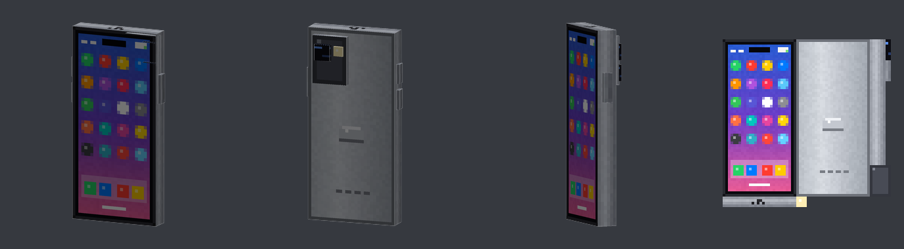

# Celular

Módulo `celular` de BigCasares: un celular 3D que se craftea y pasa videos en la pantalla mientras lo tenés en la
mano. Diseño técnico en [`docs/superpowers/specs/2026-10-04-celular-design.md`](../superpowers/specs/2026-10-04-celular-design.md)
y plan con el reporte final en [`docs/superpowers/plans/2026-10-04-celular.md`](../superpowers/plans/2026-10-04-celular.md).



## Cómo se consigue

- **Receta** (mesa de crafteo):

  ```
  H H H
  H V H      H = lingote de hierro    V = vidrio
  H H H
  ```

  Da 1 celular (no se apila). La receta aparece sola en el libro de recetas al entrar.
- **Aldeas:** el **primer cofre que alguien abre en cada aldea** trae un celu, además de su loot normal. La aldea queda
  marcada dentro del mundo, así que no da otro aunque se reinicie el servidor. Las aldeas que ya se saquearon antes de
  instalar el módulo no tienen.
- **Comando (OP):** `/celular give [jugador]` (alias `/celu`). Sin jugador, te lo da a vos.

## Cómo se usa (Java)

- Con el celu en la mano, la pantalla pasa un video. En el inventario, en el piso y en los marcos se ve el celu quieto.
- **F** pasa al siguiente video y **Shift + F** vuelve al anterior. Del último vuelve al primero.
- Al cambiar de video, el celu no baja ni sube en la mano: solo cambia la pantalla.
- Abajo de la pantalla aparece el número y el título, por ejemplo `▶ 3/15  Nutella Jar Chocolate`.
- Cada celu recuerda su video. Los nuevos arrancan en el primero.
- **Q** tira el celu como cualquier ítem.

¿Por qué F y no otras teclas? Minecraft no le avisa al servidor de teclas sueltas (I, O, G...). F es "cambiar de mano",
que sí le llega, y el juego espera la respuesta del servidor antes de cambiar las manos, así que el celu queda quieto.
Con Q el juego saca el ítem de la mano antes de preguntar, y eso hacía la animación de bajar y subir.

## Bedrock

Los jugadores de Bedrock entran con **Geyser + Floodgate**. Para ellos:

- El celu se ve en **3D en la mano**, con **"Pobre"** escrito en la pantalla, y con su ícono en el inventario.
- **No pasa videos ni tiene controles:** Bedrock no tiene texturas animadas para ítems.
- Si lo craftean, les sale en el chat: **"Dale bobi, no tenes java?, bancatela pibe"**.

Qué tiene que tener el servidor:

| Qué | Dónde | Para qué |
|---|---|---|
| **Geyser-Spigot** | `plugins/` | Deja entrar a los de Bedrock |
| **Floodgate** | `plugins/` | Entran con su cuenta de Bedrock. BigC lo usa para saber quién es de Bedrock |
| `geyser-integration.custom-items: true` y `bedrock-resource-pack: true` | `config.yml` de BigC | Vienen así por defecto |

No hace falta instalar nada a mano: el módulo `geyser-integration` registra en Geyser un ítem de Bedrock por cada
modelo del celu, y el pack de Bedrock de BigC (el que ya les manda Geyser) trae el modelo, la textura y el ícono.
GeyserModelEngine no hace falta para el celu (es para los modelos de mobs).

**No probado con un cliente de Bedrock.** El modelo y su posición en la mano se pasaron de Java a Bedrock con las
reglas de java2bedrock. Si se ve espejado o mal ubicado, se corrige en `tools/celular/generar_bedrock.py`.

## Config

En `plugins/BigCasares/config.yml`:

```yaml
modules:
  celular:
    enabled: true      # prende o apaga todo el módulo

celular:
  recipe:
    enabled: true      # la receta de 8 hierros + 1 vidrio
  village-loot:
    enabled: true      # el celu en el primer cofre de cada aldea
```

Permiso: `bigcasares.celular.admin` (OP por defecto, incluido en `bigcasares.*`) para `/celular give`.

## Videos

- Vienen 15 videos verticales, pixelados a **72x128**, a **10 cuadros por segundo**, de hasta **60 segundos** cada uno.
- **No tienen sonido** y, al cambiar de video, **no arranca desde el principio**: las texturas animadas corren en loop en
  el juego de cada jugador desde que se carga el pack, y el servidor no sabe en qué cuadro van.
- Ocupan unos **170 MB de memoria** en el Minecraft de cada jugador y unos **28 MB** en el pack de Java. Por eso van a
  10 fps y cortados a 60 segundos.

### Agregar o cambiar videos

Necesita Python 3 con Pillow y NumPy, y ffmpeg en el PATH.

1. Poné los videos (`.mp4`, `.webm`, `.mkv` o `.mov`) en `tools/celular/videos/`. Esa carpeta no se sube al repo.
2. Corré:

   ```bash
   python tools/celular/convertir_videos.py
   python tools/celular/generar_bedrock.py
   ```

3. `.\gradlew.bat clean build` y subí el jar nuevo.

Los videos se ordenan por cuándo se agregaron a la carpeta (los nuevos van al final) y el título sale del nombre del
archivo, sin el `[id]` de YouTube, los #hashtags ni los emojis. Si no son verticales (por ejemplo 3:4), entran enteros
con barras negras.

## Archivos

| Qué | Dónde |
|---|---|
| Código | `src/main/java/dev/linqfy/bigCasares/modules/celular/` |
| Tests | `src/test/java/dev/linqfy/bigCasares/modules/celular/` |
| Lista de videos (generada) | `src/main/resources/celular/videos.yml` |
| Pack de Java: modelos, texturas y videos | `resourcepack/java/assets/celular/` |
| Pack de Bedrock: modelo, animaciones, attachables y textura | `resourcepack/bedrock/` (archivos `celular*`) |
| Ícono de Bedrock | `resourcepack/shared/textures/item/celular_bedrock.png` (entrada `celular` de `registry.yml`) |
| Generadores | `tools/celular/generar_celular.py` (modelo y textura), `convertir_videos.py`, `generar_bedrock.py` |
| Ítems de Geyser | `GeyserIntegrationModule#celularItemDefinitions()` |

Si cambiás el diseño del celu, editá `tools/celular/generar_celular.py` y corré los tres scripts en orden:
`generar_celular.py`, `convertir_videos.py` y `generar_bedrock.py`.

Tests del módulo:

```bash
./gradlew test --tests "dev.linqfy.bigCasares.modules.celular.*"
```
